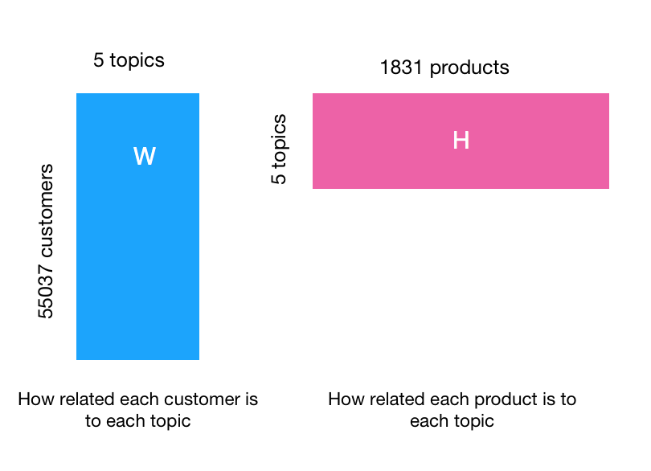

# This repo corresponds to [my Medium post!](https://medium.com/@domvandendries/using-ml-to-predict-lifetimes-of-new-customers-685051ff75f8?source=friends_link&sk=79600802708579d86df13eee69aceb34)

## Intro & Motivation
NMF is a powerful linear-algebra tool often used in recommender systems, as it performs well in sparse circumstances. NMF can extract latent "topics" from a matrix - think movie genres, article subjects, etc. It works by decomposing an m x n matrix into a m x p matrix, W, and a p x n matrix, H, with p being the number of latent topics.

# Intrigued? Read the rest on [Medium!](https://medium.com/@domvandendries/using-ml-to-predict-lifetimes-of-new-customers-685051ff75f8?source=friends_link&sk=79600802708579d86df13eee69aceb34)
